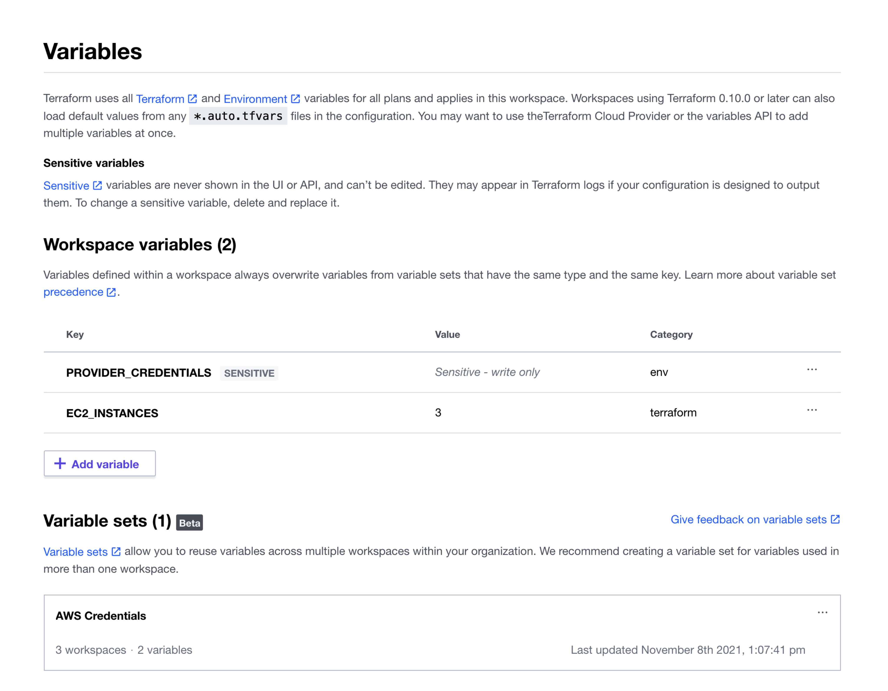
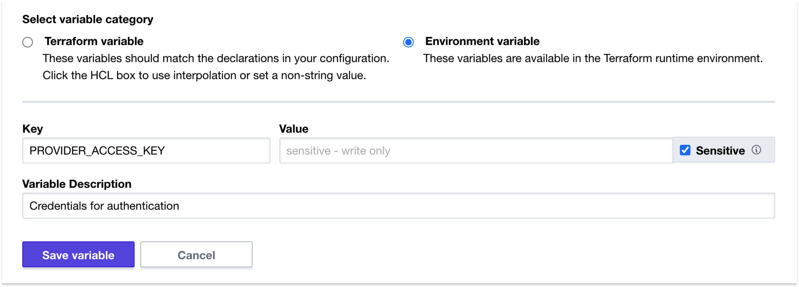

# Managing Variables

You can set variables specifically for each workspace or you can create variable sets to reuse the same variables across multiple workspaces. Refer to the [variables overview](/docs/cloud/workspaces/variables.html) documentation for more information about variable types, scope, and precedence.

-> **Note:** Variable sets are in beta.

You need [`read and write variables` permissions](/docs/cloud/users-teams-organizations/permissions.html#general-workspace-permissions) to create and edit both workspace-specific variables and variable sets. You can manage variables and variable sets through:

- The Terraform Cloud UI, as detailed below.
- The Variables API for [workspace-specific variables](/docs/cloud/api/workspace-variables.html) and [variable sets](/docs/cloud/api/variable-sets.html).
- The `tfe` provider's [`tfe_variable`](https://registry.terraform.io/providers/hashicorp/tfe/latest/docs/resources/variable) resource, which can be more convenient for bulk management.

## Workspace-Specific Variables

To view and manage a workspace's variables, go to the workspace and click the **Variables** tab.

The **Variables** page appears, showing all workspace-specific variables and variable sets applied to the workspace. This is where you can add, edit, and delete workspace-specific variables. You can also apply and remove variable sets from the workspace.




### Add a Variable

To add a variable:

1. Go to the workspace **Variables** page and click **+ Add variable** in the **Workspace Variables** section.

1. Choose a variable type (Terraform or environment), optionally mark the variable as [sensitive](#sensitive-values), and enter a variable key, value, and optional description.

    Refer to [variable values and format](#variable-values-and-format) for variable limits, allowable values, and formatting.

1. Click **Save variable**. The variable now appears in the list of the workspace's variables and Terraform Cloud will apply it to runs.

  

### Edit a Variable

To edit a variable:

1. Click the ellipses next to the variable you want to edit and select **Edit**.
1. Make any desired changes and click **Save variable**.


### Delete a Variable

To delete a variable:

1. Click the ellipses next to the variable you want to delete and select **Delete**.
1. Click **Yes, delete variable** to confirm your action.

## Variable Sets

> **Hands On:** Try the [Manage Variable Sets in Terraform Cloud tutorial](https://learn.hashicorp.com//tutorials/terraform/manage-variable-sets) on HashiCorp Learn.

To view variable sets for your organization, click **Settings** in the top menu bar, then click **Variable sets** in the left sidebar.

The **Variable sets** page appears, listing all of the organization's variable sets. Click on a variable set to open it and review details about its variables and scoping.


### Create Variable Sets

-> **Note:** Variable sets are currently in beta.

To create a variable set:

1. Go to the **Variable Sets** page for your organization and click **Create variable set**. The **Create a new variable set** page appears.

  


1. Choose a descriptive **Name** for the variable set. You can use any combination of numbers, letters, and characters.

1. Write an optional **Description** that tells other users about the purpose of the variable set and what it contains.

1. Choose a variable set scope:
   - **Apply to all workspaces in this organization:** Terraform Cloud will automatically apply this global variable set to all existing and future workspaces.
   - **Apply to specific workspaces:** Use the text field to search for and select one or more workspaces to apply this variable set to.


1. Add one or more variables: Click **+ Add variable**, choose a variable type (Terraform or environment), optionally mark the variable as [sensitive](#sensitive-values), and enter a variable name, value, and optional description. Then, click **Save variable**.

    Refer to [variable values and format](#variable-values-and-format) for variable limits, allowable values, and formatting.

    ~> **Warning:** Be careful when duplicating existing variables. Terraform Cloud will not create a variable set if you select the **Apply to all workspaces in this organization** scope and declare one or more variables with the same key as variables in other global variable sets.

1. Click **Create variable set.** Terraform Cloud adds the new variable set to any specified workspaces and displays it on the **Variable Sets** page.

### Edit Variable Sets

To edit or remove a variable set:

1. Click **Settings** in the top menu bar and then click **Variable Sets** in the left sidebar. The **Variable sets** page appears.
1. Click the variable set you want to edit. That specific variable set page appears, where you can change the variable set settings. Refer to [create variable sets](#create-variable-sets) for details.

### Delete Variable Sets

To delete a variable set:

1. Click **Settings** in the top menu bar, then click **Variable Sets** in the left sidebar. The **Create a new Variable set** page appears.
1. Select **Delete variable set**. Enter the variable set name and click **Delete variable set** to confirm this action. Terraform Cloud deletes the variable set and removes it from all workspaces.

### Apply or Remove Variable Sets From Inside a Workspace

To apply a variable set to a specific workspace:

1. Navigate to the workspace and click the **Variables** tab. The **Variables** page appears, showing all workspace-specific variables and variable sets applied to the workspace.

2. In the **Variable sets** section, click **Apply Variable Set**. Select the variable set you want to apply to your workspace, and click **Apply variable set**. The variable set appears in the workspace's variable sets list and Terraform Cloud will now apply the variables to runs.

To remove a variable set from within a workspace:

1. Navigate to the workspace and click the **Variables** tab. The **Variables** page appears, showing all workspace-specific variables and variable sets applied to the workspace.
1. Click the ellipses button next to the variable set and select **Remove variable set**.
1. Click **Remove variable set** in the dialog box. Terraform Cloud removes the variable set from this workspace, but it remains available to other workspaces in the organization.

## Overwrite Variable Sets

You can overwrite variables defined in variable sets within a workspace. For example, you may want to use a different set of provider credentials in a specific workspace.

To overwrite a variable from a variable set, [create a new workspace-specific variable](#workspace-specific-variables) of the same type with the same key. Terraform Cloud marks any variables that you overwrite with a yellow exclamation point and provides a link to the variable it will use during runs.


Variables within a variable set can also automatically overwrite, or are overwritten by, variables with the same key in other variable sets applied to the workspace. Refer to [variable precedence](/docs/cloud/workspaces/variables.html#precedence) for more details.

## Variable Values and Format

The limits, allowable values, and required format are the same for both workspace-specific variables and variable sets.

### Security

Terraform Cloud encrypts all variable values securely using [Vault's transit backend](https://www.vaultproject.io/docs/secrets/transit/index.html) prior to saving them. This ensures that no out-of-band party can read these values without proper authorization. However, [descriptions](#variable-description) are not encrypted, so be careful with the information you save in a variable description.

We also recommend using environment variables when possible to avoid unnecessary credential disclosure. Terraform runs receive the full text of [sensitive](#sensitive-values) Terraform variables and may print the value in logs and state files if the configuration sends the value to an output or a resource parameter. Sentinel mocks downloaded from runs will also contain the sensitive values of Terraform variables. Environment variables can also be included in log files if `TF_LOG` is set to `TRACE`.

### Variable Limits
The following limits apply to variables:

Component   |  Limit
------------|---------------------------
description |  512 characters
key         |  128 characters
value       |  256 kilobytes

### Multi-Line Text

You can type or paste multi-line text into variable value text fields.

### HashiCorp Configuration Language (HCL)

You can use HCL for Terraform variables, but not for environment variables. The same Terraform version that performs runs in the workspace will interpret the HCL.

Variable values are strings by default. To enter list or map values, click the variable’s **HCL** checkbox (visible when editing) and enter the value with the same HCL syntax you would use when writing Terraform code. For example:

```hcl
{
    us-east-1 = "image-1234"
    us-west-2 = "image-4567"
}
```
### Sensitive Values

!> **Warning:** There are some cases when even sensitive variables are included in logs and state files. Refer to [security](#security) for more information.

Terraform often needs cloud provider credentials and other sensitive information that should not be widely available within your organization. To protect these secrets, you can mark any Terraform or environment variable as sensitive data by clicking its **Sensitive** checkbox that is visible during editing.

Marking a variable as sensitive makes it write-only and prevents all users (including you) from viewing its value in the Terraform Cloud UI or reading it through the Variables API endpoint.

Users with permission to read and write variables can set new values for sensitive variables, but other attributes of a sensitive variable cannot be modified. To update other attributes, delete the variable and create a new variable to replace it.

[permissions-citation]: #intentionally-unused---keep-for-maintainers


### Variable Description

!> **Warning:** Variable descriptions are not encrypted, so do not include any sensitive information.

Optional variable descriptions help distinguish between similarly named variables. They are only shown on the **Variables** page and are completely independent from any variable descriptions declared in Terraform CLI.
