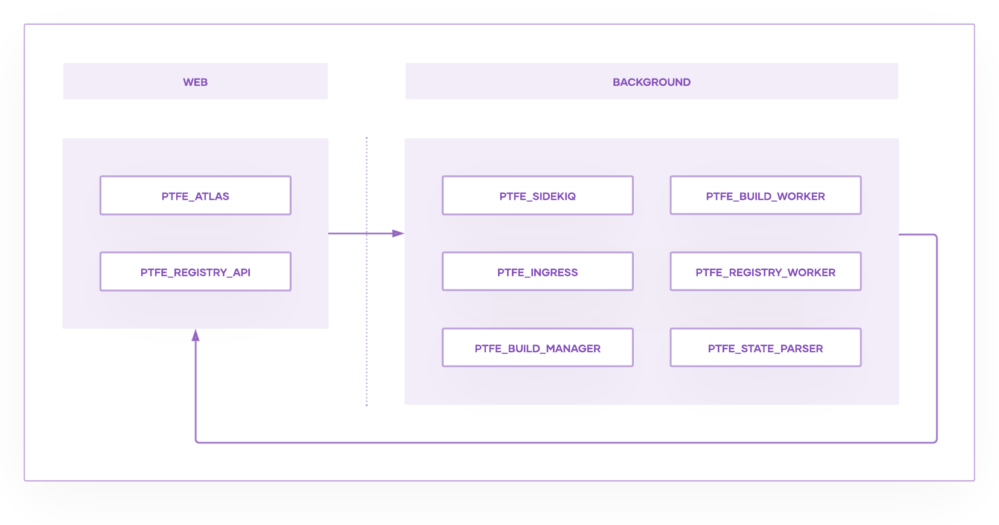
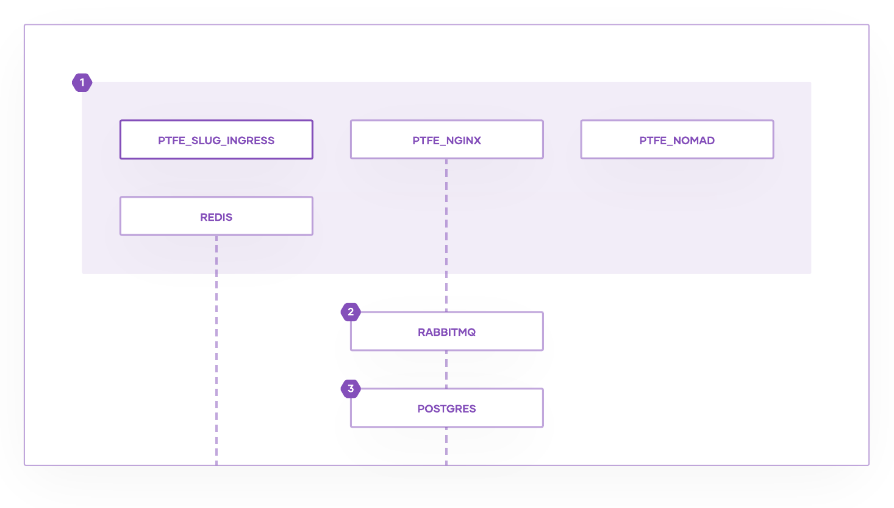
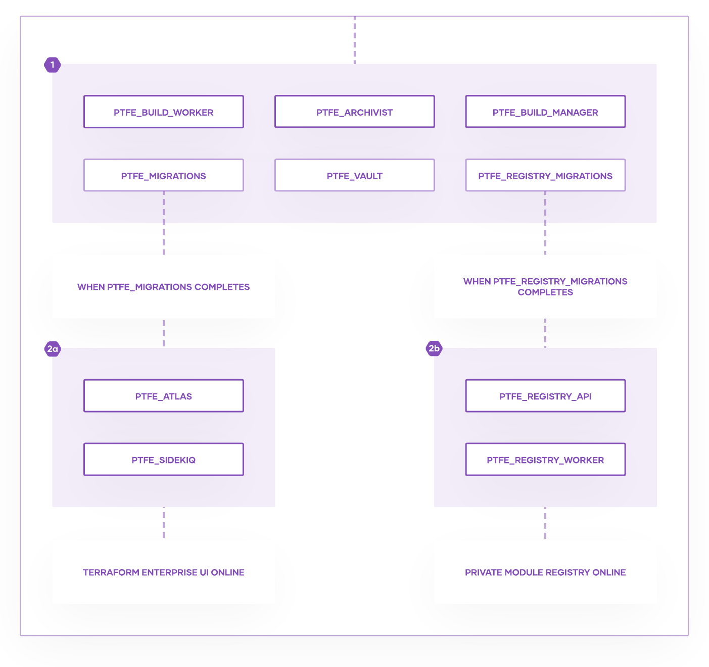
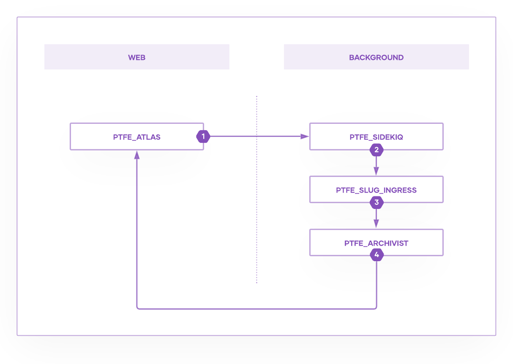
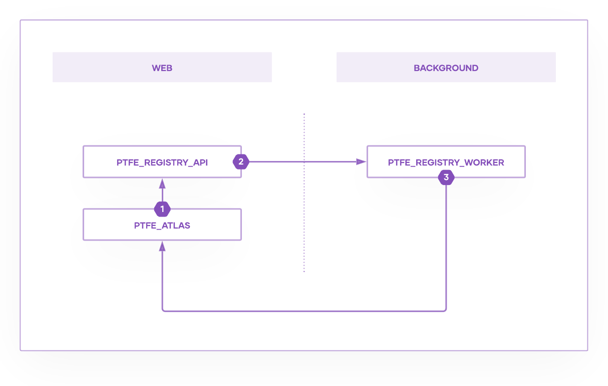
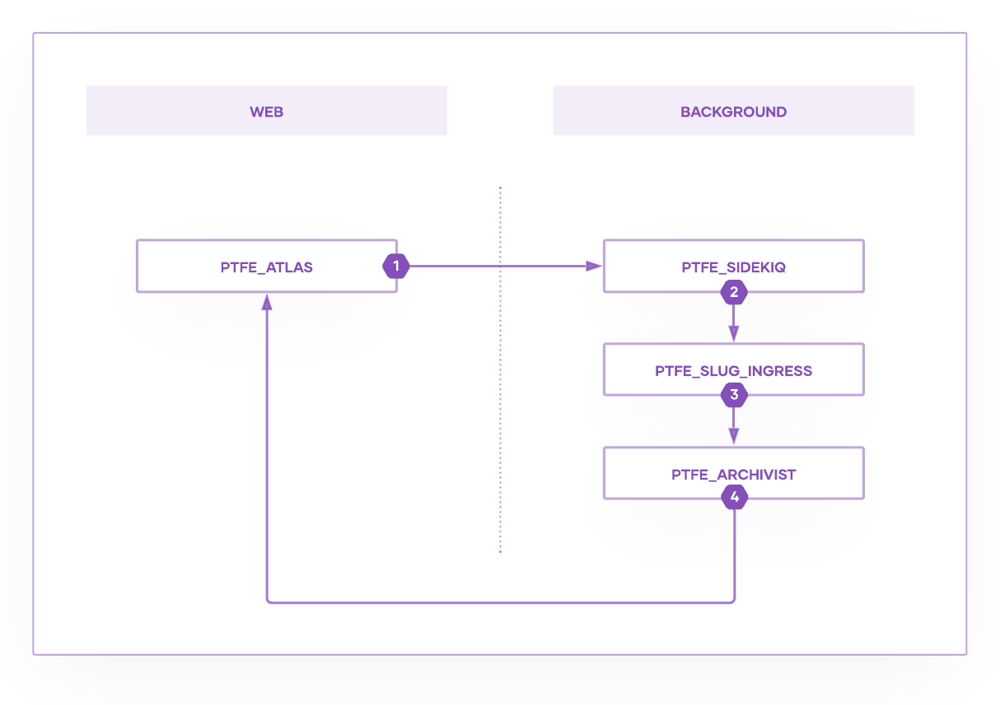
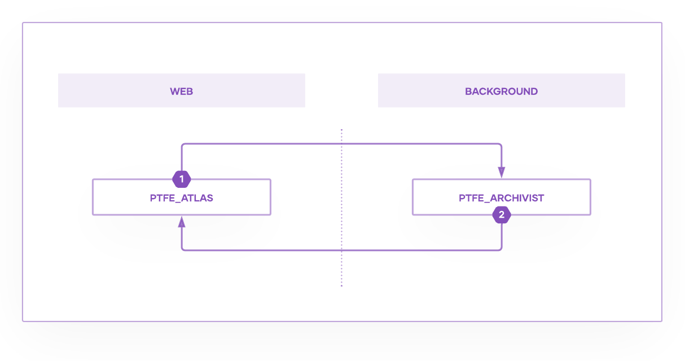

# Terraform Enterprise Architecture

Terraform Enterprise is powered by the same set of services behind HashiCorp’s public SaaS application Terraform Cloud. The sections below present the functional layers of the architecture, how they interact and details pertaining to the corresponding Docker containers involved. References to Docker containers in this document are those you will see when running a `docker ps` on a Terraform Enterprise application server while the application is up.

~> **Advanced:** The content in this document is not required to operate Terraform Enterprise but is provided to help advanced users understand the product in more depth.

~> **Note:** Several services described below include the legacy string `ptfe` as part of their names. See [here](https://www.terraform.io/docs/enterprise/index.html#note-about-product-names) for more details.

## Application Layer

The application layer is divided conceptually into two areas, each with specific responsibilities:

- Web Services - Answer requests forwarded by NginX and enqueue jobs for later
- Background Services - Asynchronously process jobs enqueued by web services

Most requests in Terraform Enterprise follow a similar lifecycle as shown in the diagram below.

A web service receives a request and enqueues a background job to perform the task via the Coordination Layer (see below).  The web service then responds immediately to the original request instead of waiting for the job to be finished.

A background service later claims the job from the Coordination Layer and performs the resource- or time-intensive task in the background without blocking the web service.

Finally, the original web service is notified when then task is complete via an internal webhook.

### Web Services

These services answer requests from the UI and API as well as incoming webhooks from a connected VCS.

### Background Services

This is the largest part of the Application Layer and includes multi-purpose Sidekiq workers, Go services that provide key functionality of Terraform Enterprise, and a dynamic fleet of isolated execution environments that perform Terraform runs.

## Coordination Layer

The Coordination Layer is responsible for queuing asynchronous jobs and distributing them to background services running in the Application Layer. Standalone deployments will start a local Redis container for this purpose and Active/Active deployments will use an external Redis service.

~> **Note:** While these components are critical to the overall operation of Terraform Enterprise, operators rarely (if ever) need to look at them directly.

## Storage Layer

All application data is stored in PostgreSQL and object storage. If you have selected Mounted Disk mode, local services will be started for you, otherwise, the appropriate services will be configured to access a external PostgreSQL, S3-compatible blob storage, and, in active-active, Redis.

~> **Note:** The configuration information provided and/or generated during installation (e.g. database credentials, hostname, etc.) is stored outside of the application.

## Key Component Interactions

This section details how the key containers work together to accomplish common tasks.

### Initial Startup - External Services Mode

1. The first batch of services starts in parallel.
2. Once `ptfe_nginx` has started, `rabbitmq` starts.

### Initial Startup - Mounted Disk Mode

1. The first batch of services starts in parallel.
2. Once `ptfe_nginx` has started, `rabbitmq` starts.
3. Once `rabbitmq` has started, `postgres` starts.

### Wait for Dependencies

The application waits for `postgres`, `redis`, and `rabbitmq` to start as above. Once these key services respond successfully to requests, the startup process completes with the following steps.

1. The remaining services that do not rely on PostgreSQL are launched in parallel. Included in this batch are or two short lived containers, `ptfe_migrations` and `ptfe_registry_migrations`, which exist only to apply any necessary updates to the database schema. 
2. The main **web** and **background** services start up:
 2a. Once `ptfe_migrations` has finished, `ptfe_atlas` and `ptfe_sidekiq` are started in parallel.
 2b. Once `ptfe_registry_migrations` has finished, `ptfe_registry_api` and `ptfe_registry_worker` are started in parallel.

Finally, startup is complete and the application is ready to go at your configured hostname.

### Module Ingress

The process of importing Terraform modules into the private module registry starts with either a click in the UI or a `POST` to the API. The request is handled the same way in both cases:

1. `ptfe_atlas` receives request from `ptfe_nginx`, pushes a job to Redis for `ptfe_sidekiq`, and then responds to the original request immediately.
1. `ptfe_sidekiq` asynchronously pulls the job and passes the details to `ptfe_slug_ingress`.
1. `ptfe_slug_ingress` downloads your Git repository and `POST`s it to `ptfe_archivist`.
1. `ptfe_archivist` persists the repository in blob storage and `POST`s the Object ID to `ptfe_atlas`.

At this point, each tagged version of your repository has been persisted in the application. The process to make the modules available in your private module registry begins next:

1. `ptfe_atlas` sends the Object ID from `ptfe_archivist` to the `ptfe_registry_api`.
1. `ptfe_registry_api` pulls the module from `ptfe_archivist`, saves the metadata in PostgreSQL, and passes the details to the `ptfe_registry_worker`.
1. `ptfe_registry_worker` extracts the individual modules from your repository, updates the Private Registry tables in PostgreSQL, and `POST`s the results to `ptfe_atlas`.

Finally, `ptfe_atlas` receives the callback and sets the module’s state to *ingressed* in PostgreSQL. The update is now live in the UI.

### Webhook Receipt

Communications between Terraform Enterprise and a connected VCS server happen via HTTP webhooks.  The latest state of the connected Git repository is downloaded using the process below, and then followup Terraform commands are applied by the state machine.

1. `ptfe_atlas` receives request from `ptfe_nginx`, pushes a job to Redis for `ptfe_sidekiq`, and then responds to the original request immediately.
1. `ptfe_sidekiq` asynchronously pulls the job and passes the details to `ptfe_slug_ingress`.
1. `ptfe_slug_ingress` spawns a separate `git clone` of your Git repository and `POST`s it to `ptfe_archivist`.
1. `ptfe_archivist` persists the repository in blob storage and `POST`s the Object ID to `ptfe_atlas`.

### Terraform Plan and Apply

A state machine inside `ptfe_atlas` watches your workspaces at all times. The process is started when a plan or apply begins. The diagram below applies to both plan and apply stages.

1. `ptfe_atlas` detects a state change and enqueues a background job for `ptfe_sidekiq` in Redis.
2. `ptfe_sidekiq` asynchronously pulls the job and passes the details to `ptfe_build_manager`.
3. `ptfe_build_manager` enqueues a `ptfe_build_worker` job in RabbitMQ.
4. `ptfe_build_worker` spins up a temporary environment, runs a Terraform plan or apply, and passes the results to `ptfe_archivist`.
5. `ptfe_archivist` persists the plan or apply results and returns a URL to `ptfe_build_worker`.
6. `ptfe_build_worker` passes the plan or apply results back to `ptfe_build_manager`.
7. `ptfe_build_manager` `POST`s the results to an internal webhook.
8. `ptfe_nginx` receives the request and forwards the callback to `ptfe_atlas`.

Finally, `ptfe_atlas` receives results of the plan or apply and begins next actions if any apply.

### Sentinel Run

A state machine inside `ptfe_atlas` is responsible for scheduling Sentinel runs when necessary.

1. `ptfe_atlas` detects a state change and queues a background job for `ptfe_sidekiq` in Redis.
1. `ptfe_sidekiq` asynchronously pulls the job and schedules a Sentinel run in `ptfe_nomad`.
1. `ptfe_nomad` runs the Sentinel job and `POST`s the result back to `ptfe_atlas`.

Although the result of the Sentinel run is known at this point, it is not persisted until the callback is processed:

1. `ptfe_atlas` receives the callback request from `ptfe_nginx` and streams the response to `ptfe_archivist`.
2. `ptfe_archivist` saves the Sentinel results to blob storage and returns an Object ID to `ptfe_atlas`.

Finally, `ptfe_atlas` updates the metadata in PostgreSQL after it receives confirmation that the details of the run have been persisted.

## Long-Running Container List

The following table lists every container Terraform Enterprise runs via the Replicated Native Scheduler.  The list is presented by layer as per the above document sections and includes those long-running processes only, not ephemeral containers.

| Layer | Container Name | Process Name | Container Function |
| - | - | - | - |
| Web Services | `ptfe_atlas` | Atlas | Ruby on Rails application that powers the UI and API. |
|  | `ptfe_registry_api` | Private Registry API | Go service that powers the private module registry. |
|  | `ptfe_nginx` | Nginx | NginX is used as a router in Terraform Enterprise. |
| Background Services | `ptfe_sidekiq` | Sidekiq | Ruby workers that run asynchronous jobs enqueued by `ptfe_atlas`. |
|  | `ptfe_state_parser` | Terraform State Parser | Go service that parses Terraform State Files. |
|  | `ptfe_build_manager` | Terraform Build Manager | Go service that coordinates Terraform runs, plan and applies. |
|  | `ptfe_registry_worker` | Private Module Registry Worker | Go service that parses Git repositories for Private Registry. |
|  | `ptfe_build_worker` | Terraform Build Worker | Go service that manages the lifecycle of isolated worker containers. |
|  | `ptfe_slug_ingress` | Slug Ingress | Go service that imports Git repositories. |
| Coordination Layer | `ptfe_redis` | Redis Cache | In-memory database used for caching and Sidekiq queue. Only used in Mounted Disk mode and Standalone External Services mode deployments (not Active/Active). |
|  | `rabbitmq` | RabbitMQ | Message broker used between Go services. |
|  | `ptfe_nomad` | Nomad | Scheduler used to run Sentinel policies. Nomad also handles cost-estimation runs and plan export jobs. |
| Storage | `ptfe_postgres` | PostgreSQL | Only used in Mounted Disk mode deployments. |
|  | `ptfe_archivist` | Archivist | Go service that provides a universal interface to blob storage. |
|  | `ptfe_vault` | Vault | Service used to manage secrets and protect sensitive data. |
| Replicated | `replicated` | Replicated | The daemon that runs Replicated services and starts the application. It communicates with the external Replicated API and registry unless running in airgap mode. This is the only component that communicates externally. |
|  | `replicated-operator` | Replicated Operator | A utility image to transfer files between the host and daemon and to run application containers if using the native scheduler. It communicates internally with the Replicated daemon on port 9879. |
|  | `replicated-ui` | Replicated UI | Provides the Replicated console which listens on host port 8800. It communicates internally with the Replicated daemon and with the premkit service. Absent in Active/Active. |
|  | `replicated-premkit` | Replicated Premkit | This serves as a reverse proxy to the audit log, metrics, and integration services. It communicates internally with the daemon, audit log, and metrics services. |
|  | `replicated-statsd` | Replicated StatsD | StatsD is a network daemon that listens for statistics and aggregates them for consumption. This is used to collect details for Terraform Enterprise support bundles. |
|  | `retraced-api` | RetraceD API | API provider for the audit log component of Replicated and communicates internally with the audit log’s Postgres and NSQ services. |
|  | `retraced-cron` | RetraceD Cron | Used to provide time-based audit message queue processing. |
|  | `retraced-nsqd` | RetraceD NSQD | This is the queue for the Replicated audit log and is internal to Replicated. |
|  | `retraced-processor` | RetraceD Processor | Processing facility for the audit log component of Replicated and communicates internally with the audit log’s Postgres and NSQ services |
|  | `retraced-postgres` | RetraceD PostgreSQL | This is the database for the Replicated audit log and is internal to Replicated. |
|  | `statsd-graphite` | StatsD | This image is used for a metrics service that runs when the application is running. |
|  | `support-bundle` | Support Bundle Generator | This image is run to collect system information when the customer creates a support bundle. |
| Auxiliary | `influxdb` | InfluxDB |  This open source time series database is used with Telegraf for observability reasons. |
|  | `telegraf` | Telegraf | This open source server agent for collecting and sending metrics and is used with InfluxDB for observability reasons. |
|  | `ptfe_backup_restore` | Terraform Enterprise Backup API | This container facilitates the [Terraform Enterprise backup function](https://www.terraform.io/docs/enterprise/admin/backup-restore.html). Also see the [Terraform Enterprise backup recommended pattern](https://learn.hashicorp.com/tutorials/terraform/pattern-backups?in=terraform/recommended-patterns). |
|  | `ptfe_health_check` | Terraform Enterprise Health Check API | Used to provide the [health check endpoint](https://www.terraform.io/docs/enterprise/admin/monitoring.html). |
|  | `ptfe_outbound_http_proxy` | Terraform Enterprise Outbound HTTP Proxy | This was recently added to mitigate for server-side request forgery. |
|  | `tfe-admin` | Terraform Enterprise Admin | Additional Active/Active node management facilities only. |

## Data Flow Diagram

The following diagram shows the way data flows through the various services and data stores in Terraform Enterprise.  Click the image for a closer look.

(Note: The services in double square brackets are soon to be replaced by the service that precedes them.)
